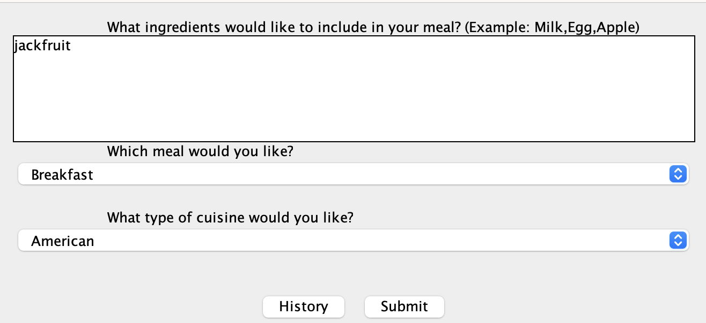
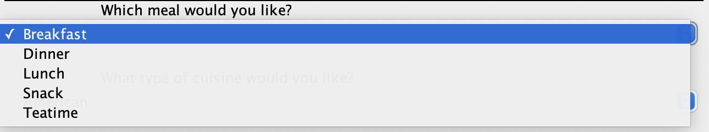
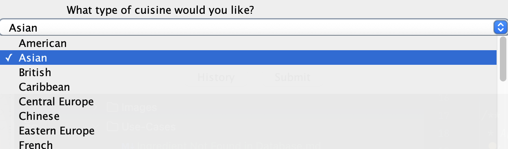
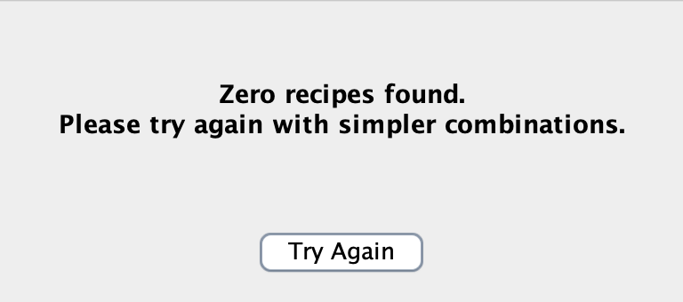

# Edge Case: Ingredient Not Found in Database

**Goal:**  
When a user enters an unfamiliar or unsupported ingredient, the system should clearly inform them that the ingredient is not recognized, allowing them to easily revise their input and continue exploring recipes without confusion or interruption.

---

## Preconditions
- The user is on the main screen of the recipe application.
- The user has already entered at least one ingredient.
- System uses a predefined list or external API to recognize ingredients and recipes, potentially returning a "not found" response.

---

## Main Flow
1. **User input**
    - User types a list of ingredients, for example:
      ```
      jackfruit
      ```
      

2. **Select meal and Cuisine**
    - The user selects breakfast as meal
    - 
    - The user selects Asian as cuisine.
    - 
2. **Back‐end lookup**
    - The front end sends the above specifications to the interactor.
    - The external API starts generating recipes.
3. **Detection of Error**
    - The API returns Zero recipes found. Please Try again with simpler combinations.
    - 
4. **User Solution**
    - User can not go back to the meal selection page to re-enter their ingredients and preferences.
    - Repeat the above steps to generate a recipe that fits the users' need.

---