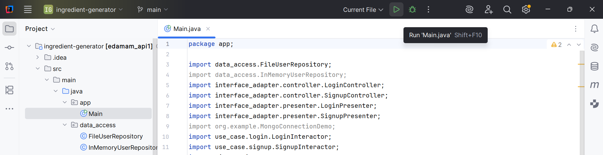

# **ingredient-generator**
A Java-based project to generate a list of ingredients for at most 3 different recipes based on user preferences. This repository is for the course project of CSC207 (Software Design) taken at the University of Toronto.

Members:
- Aryaman Bansal
- Ellen Liu
- Tommy Shen
- Caroline Xiao
- Miki Wakabayashi Zheng

## **Repository Structure**

Below is the structure of the repository, which follows the Clean Architecture principles. The project is organized into different folders, each serving a specific purpose. Below is a brief overview of the repository structure containing only the relevant files and directories:

```bash
├── src/main/java/

│   ├── app/
│   │   ├── Main.java

│   ├── data_access/
│   │   ├── FileUserRepository.java
│   │   ├── InMemoryUserRepository.java

│   ├── entity/
│   │   ├── Recipe.java
│   │   ├── RegularUser.java

│   ├── interface_adapter/
│   │   ├── controller
│   │   │   ├── LoginController.java
│   │   │   ├── SignupController.java
│   │   ├── presenter
│   │   │   ├── LoginPresenter.java
│   │   │   ├── SignupPresenter.java

│   ├── org/example/
│   │   ├── MealPreferences.java
│   │   ├── MongoConnectionDemo.java

│   ├── use_case/
│   │   ├── gateway/
│   │   │   ├── RecipeGateway.java
│   │   │   ├── UserRepository.java
│   │   ├── login/
│   │   │   ├── LoginInteractor.java
│   │   │   ├── LoginOutputBoundary.java
│   │   │   ├── LoginRequestModel.java
│   │   │   ├── LoginResponseModel.java
│   │   │   ├── LoginUseCase.java
│   │   ├── signup/
│   │   │   ├── SignupInteractor.java
│   │   │   ├── SignupOutputBoundary.java
│   │   │   ├── SignupRequestModel.java
│   │   │   ├── SignupResponseModel.java
│   │   │   ├── SignupUseCase.java

│   ├── view/
│   │   ├── Demo2.java
│   │   ├── EasterEgg.java
│   │   ├── HistoryFrame.java
│   │   ├── LoginFrame.java
│   │   ├── LoginView.java
│   │   ├── SignupFrame.java
│   │   ├── SignupView.java
│   │   ├── TopRecipesFrame.java
│   │   ├── UserProfileFrame.java

├── pom.xml
├── Preferences.txt
├── recipes.txt
├── top_recipes.txt
```

---
---
---

## **Introduction**

This project is designed to help users find the list of ingredients based on their meal preferences. It allows users to log in/sign up, enter their meal preferences, and then see a list of ingredients for at most 3 different recipes that match those preferences. Users can also view their history of past meal preferences and corresponding recipes. The application is built using Java and follows the Clean Architecture principles to ensure a well-structured and maintainable codebase.

> **PS:** The application includes an Easter egg!

---
---
---

## **File Descriptions**

Provided below are brief descriptions of the files mentioned in the above repository structure:

### **`app/`**

---
---

#### `Main.java`

---

Acts as the application entry point. It wires together all layers of the Clean Architecture, connecting controllers, presenters, interactors, and views for login and signup functionality. It sets up the necessary dependencies and launches the initial login user interface using Java Swing.

---
---

### **data_access/**

---
---

#### `FileUserRepository.java`

**Role:** Implements storage for user data using CSV files. As a data access layer, it saves and retrieves user credentials in a `users/` directory, acting as a concrete implementation of the `UserRepository` gateway interface.

**Key Functionality:**
- Loads a user by username from a CSV file.
- Saves new user credentials (username and hashed password) to a CSV file.
- Integrates with `MongoConnectionDemo` for additional (MongoDB) storage, if needed.

---

#### `InMemoryUserRepository.java`

**Role:** Provides a simple implementation of the `UserRepository` interface.

**Key Functionality:**
- Stores user credentials in memory.
- Retrieves or saves users during the runtime of the application only (data does not persist after shutdown).

---
---


### **entity/**

---
---

#### `Recipe.java`

**Role:** Defines the `Recipe` entity representing a recipe with its name (label) and a list of ingredient lines.

**Key Functionality:**
- Stores recipe title and its associated ingredient list.
- Provides read-only access to recipe data for use throughout the application (eg: for display or recommendation).

---

#### `RegularUser.java`

**Role:** Represents an individual registered user of the application as an entity class.

**Key Functionality:**

- Stores immutable user information: username and password hash.
- Encapsulates user identity and authentication credentials.

---
---

### **interface_adapter/**

---
---

#### **controller/**

---

##### `LoginController.java`

**Role:** Acts as the interface adapter between the UI (login view) and the login use-case interactor. Handles user interactions related to logging in and navigation to the signup page.

**Key Functionality:**

- Handles login button events from the UI, passing credentials to the use-case.
- Allows navigation to the signup page by interacting with `SignupController`.
- Keeps UI logic separate from business logic.

---

##### `SignupController.java`

**Role:** Serves as the interface adapter between the UI (signup view) and the signup use-case interactor. Handles user interactions related to creating a new account and navigating between views.

**Key Functionality:**
- Handles signup form submission, validating fields before passing data to the use-case.
- Controls view visibility, switching between signup and login screens as needed.

---

#### **presenter/**

---

##### `LoginPresenter.java`

**Role:** Presents the outcome of the login use-case to the user interface. Implements the output boundary for the login workflow.

**Key Functionality:**

- Notifies the login UI view of either successful or failed login attempts, displaying appropriate messages to the user.

---

##### `SignupPresenter.java`

**Role:** Presents the outcome of the signup use-case to the user interface. Implements the output boundary for the signup workflow.

**Key Functionality:**
- On successful signup, shows confirmation and navigates back to the login screen.
- On failure, displays error messages on the signup form.

---
---

### **org/example/**

---
---

#### `MealPreferences.java`

**Role:** Handles the logic and user interface for collecting and storing user meal preferences in the application.

**Key Functionality:**
- Provides a Swing GUI for users to input their meal preferences (list of food items they like, meal type, and cuisine type).
- Writes the collected preferences to a text file (eg: `Preferences.txt`) for use by other components such as recipe recommendation or ingredient generation.
- Facilitates smooth user interaction as a central UI screen in the app.

---

#### `MongoConnectionDemo.java`

**Role:** Demonstrates how to connect to a MongoDB database from the Java application.

**Key Functionality:**
- Sets up a connection with a local or remote MongoDB instance.
- Contains code for inserting, retrieving, or interacting with MongoDB collections (often for learning, testing, or as an optional backend for persistent storage).
- Provides sample methods to help integrate MongoDB into the application if switching from file-based storage to a database.

---
---

### **use_case/**

---
---

#### **gateway/**

---

##### `RecipeGateway.java`

**Role:** Defines a gateway (interface) for recipe data access, decoupling the business logic from the data storage mechanism.

**Key Functionality:**

- Specifies methods for saving, retrieving, or searching recipes.
- Allows for easy swapping of underlying recipe storage solutions (eg: file-based, database, API) without affecting core business logic.
- Supports Clean Architecture principles by abstracting data access.

---

##### `UserRepository.java`

**Role:** Defines the user repository gateway interface for user data access.

**Key Functionality:**
- Outlines required methods for saving and retrieving user information.
- Enables different implementations (in-memory, file-based, database) without altering business logic.
- Ensures that use cases depend only on abstractions, not on specific data storage solutions.

---

#### **login/**

---

##### `LoginInteractor.java`

**Role:** Implements the login use-case logic, coordinating between repository, input, and output boundaries.

**Key Functionality:**
- Receives login requests (username and password), checks credentials via the `UserRepository`.
- Notifies the output boundary (presenter) of login success or failure.
- Contains core authentication logic, isolated from UI and data access specifics.


---

##### `LoginOutputBoundary.java`

**Role:** Defines the interface for presenting the outcome of the login use case to the UI layer.

**Key Functionality:**
- Contains methods for displaying success or error messages after login attempts.
- Enables use-case layer to communicate results back to the UI through presenters.
- Supports Clean Architecture separation of concerns.

---

##### `LoginRequestModel.java`

**Role:** Encapsulates login request data passed from the controller to the interactor.

**Key Functionality:**
- Holds username and password provided by the user.
- Transfers this data between UI/controller and business logic layers in a clean, structured way.

---

##### `LoginResponseModel.java`

**Role:** Represents the data returned by the login use case after processing a login attempt.

**Key Functionality:**
- Stores information about login result (eg: username, success/failure state, error message if any).
- Passed from the interactor to the presenter to update the UI appropriately.

---

##### `LoginUseCase.java`

**Role:** Interface defining the login use-case operations.

**Key Functionality:**
- Declares the primary method(s) required to execute the login process.
- Allows different implementations (such as `LoginInteractor`) to fulfill the business logic.

---

#### **signup/**

---

##### `SignupInteractor.java`

**Role:** Implements the business logic for user signup. Coordinates between the data layer (user repository), request model, and presenter.

**Key Functionality:**
- Receives signup requests, validates input (e.g., checks if the username already exists, password meets requirements).
- Saves new user data via the `UserRepository` if validation passes.
- Notifies the presenter/output boundary about success or specific errors (such as duplicate username).

---

##### `SignupOutputBoundary.java`

**Role:** Defines how the result of the signup use case is communicated to the presentation/UI layer.

**Key Functionality:**
- Declares methods for handling both successful and failed signup attempts.
- Decouples the business logic from UI specifics, allowing for clean presentation of messages and navigation cues.

---

##### `SignupRequestModel.java`

**Role:** Encapsulates the data required to process a signup request.

**Key Functionality:**
- Stores user input fields such as username and password.
- Passes signup data from the controller/UI to the use-case interactor in a structured format.

---

##### `SignupResponseModel.java`

**Role:** Encapsulates the result data from the signup process.

**Key Functionality:**
- Stores information about the outcome of the signup attempt (eg: username, status, error messages).
- Passed from the interactor to the presenter, which then updates the UI accordingly.

---

##### `SignupUseCase.java`

**Role:** Defines the interface for the signup use-case operations.

**Key Functionality:**
- Declares the core method(s) required to carry out the signup workflow.
- Allows for multiple implementations (such as `SignupInteractor`) to provide the signup business logic.

---
---

### **view/**

---
---

#### `Demo2.java`

**Role:** Central user interface class for generating ingredient lists based on user preferences.

**Key Functionality:**
- Provides a GUI for users to input their meal preferences.
- Reads preferences from a text file and fetches recipe recommendations (eg: from an API or local source).
- Displays a list of recommended ingredients and recipes to the user.
- Acts as the main hub after login/signup for the ingredient/recipe generation feature.

---

#### `EasterEgg.java`

**Role:** Implements a fun feature for the user. 

*Hint:* type "dog" under the ingredients input section.

---

#### `HistoryFrame.java`

**Role:** Displays the user's history of recipe or ingredient searches in a GUI window.

**Key Functionality:**
- Loads and shows past search results or actions (from a file or memory).
- Allows users to review previous ingredient lists or recipes for easy access.

---

#### `LoginFrame.java`

**Role:** The graphical interface (window) for user login.

**Key Functionality:**
- Presents username and password fields for login.
- Connects UI elements (buttons, fields) to the login controller.
- Displays error messages or forwards to the main app upon successful login.

---

#### `LoginView.java`

**Role:** Acts as the main view class for the login screen, following MVC principles.

**Key Functionality:**
- Encapsulates the UI layout, appearance, and event bindings for login.
- Interacts with the presenter/controller to process user actions and display feedback.

---

#### `SignupFrame.java`

**Role:** The graphical interface (window) for new user registration (sign up).

**Key Functionality:**
- Presents fields for user input (username, password).
- Connects to the signup controller and handles signup events.
- Displays confirmation or error messages to users.

---

#### `SignupView.java`

**Role:** View class for the signup process, separating UI logic from core logic.

**Key Functionality:**
- Manages UI layout and user interactions for account creation.
- Communicates with the presenter/controller and updates the display based on signup outcome.

---

#### `TopRecipesFrame.java`

**Role:** Shows the top recommended recipes in a visually organized frame/window.

**Key Functionality:**
- Reads a list of top recipes (from a file such as `top_recipes.txt`).
- Presents the recipe names, details, and possibly allows user interaction (eg: viewing more details).

---

#### `UserProfileFrame.java`

**Role:** Displays and possibly allows editing of the user's profile information.

**Key Functionality:**
- Shows username, saved preferences, or profile-related details.
- May provide options for the user to update their preferences or view their account history.

---
---
---

## **A note on how this project integrates Clean Architecture principles**

something...

---
---
---

## **How to Run the Application**

1. **Clone the Repository:**
```bash
git clone https://github.com/aryaman1802/ingredient-generator.git
cd ingredient-generator
```

2. **Run the Application:**

Navigate to the project directory and run the `Main.java` file. You can use an IDE like IntelliJ IDEA:


